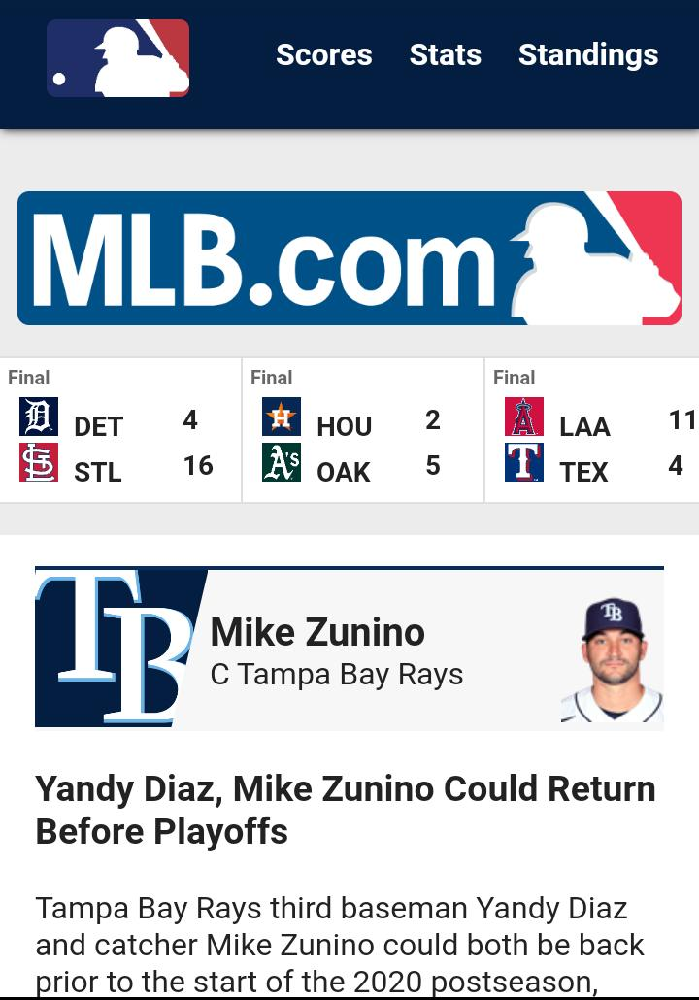
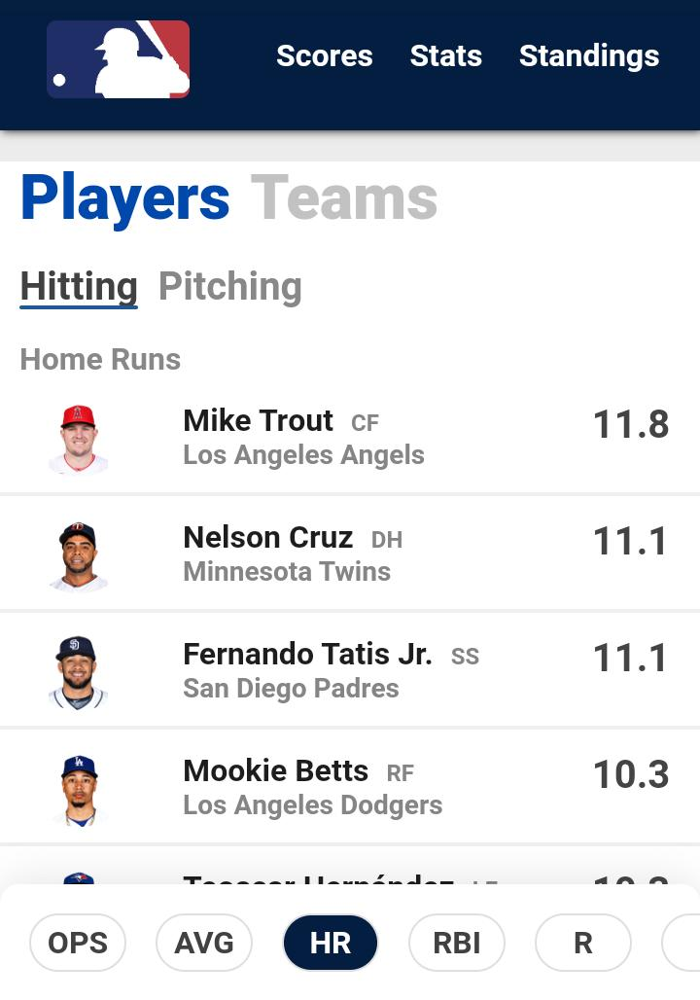
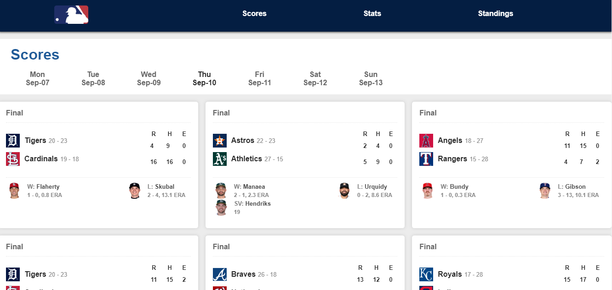
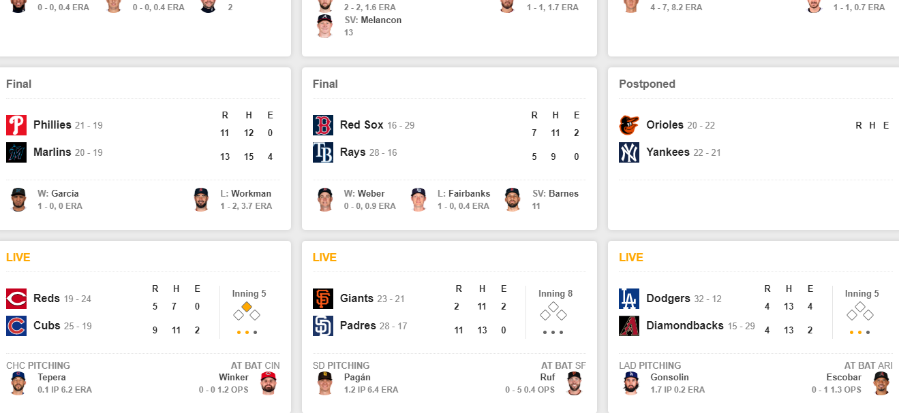

# MLB STATS APP

Simple site show stats of different teams and players in mlb

**App Screenshot**

[See App](https://mlb-stats-app.marcos-coca.vercel.app)

# ¿How Works?

Require Node.JS 10+

- `npm install` for install al dependencies.

- `npm run build:dev && npm run dev` for development environment.

- `npm run build && npm start` for production environment.
